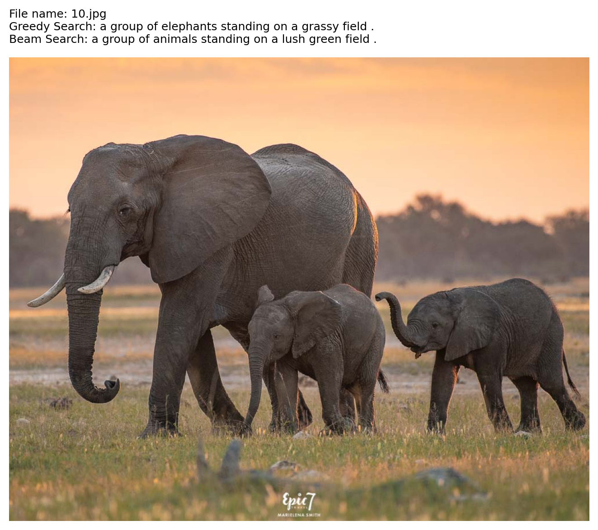

# Evaluating-the-evolution-of-Deep-Learning-architecture-in-the-Image-Captioning-problem


```markdown
# 📷 Image Captioning: Evaluating the Evolution of Deep Learning Architectures

Dự án này nhằm mục đích xây dựng, huấn luyện và đánh giá sự tiến hóa của các kiến trúc Deep Learning trong bài toán sinh mô tả ảnh tự động (Image Captioning). Hệ thống hỗ trợ 3 kiến trúc từ cơ bản đến SOTA:
1. **Baseline**: ResNet50 (Encoder) + LSTM (Decoder).
2. **ViT + Transformer**: Vision Transformer (Encoder) + Transformer (Decoder).
3. **M2 Transformer**: ResNet50 Spatial (Encoder) + Meshed-Memory Transformer (Decoder).

---

## 📂 Cấu trúc thư mục (Project Structure)

```text
Evaluating-the-evolution-of-Deep-Learning-architecture/
├── main.py                            # Script chính để huấn luyện mô hình (Train)
├── inference.py                       # Script để sinh caption bằng 2 phương pháp cho ảnh tự nhập 
├── requirements.txt                   # Danh sách thư viện cần thiết
├── notebook/                          # Các notebooks phân tích   
├── configs/                           # Chứa các file cấu hình YAML cho từng mô hình
│   ├── baseline_lstm.yaml
│   ├── vit_transformer.yaml
│   └── m2_transformer.yaml
├── experiments/                       # Thư mục tự động sinh ra chứa Checkpoints, Vocab, Logs và Captions
└── src/                               # Mã nguồn chính của dự án
    ├── data/                          # Xử lý dữ liệu (Dataset, Dataloader, Vocabulary)
    ├── models/                        # Định nghĩa kiến trúc mạng (Encoder, Decoder)
    ├── evaluation/                    # Đánh giá mô hình
    └── training/                      # Vòng lặp huấn luyện, hàm Loss (Train, Loss)

```

---

## ⚙️ Hướng dẫn cài đặt (Installation)

### Bước 1: Chuẩn bị môi trường ảo (Virtual Environment)

Khuyến nghị sử dụng `venv` hoặc `conda` để tránh xung đột thư viện với hệ điều hành.

**Dành cho Mac/Linux:**

```bash
python3 -m venv venv
source venv/bin/activate

```

**Dành cho Windows:**

```bash
python -m venv venv
venv\Scripts\activate

```

### Bước 2: Cài đặt thư viện (Dependencies)

Chạy lệnh sau để cài đặt toàn bộ các gói thư viện cần thiết từ file `requirements.txt`:

```
bash
pip install -r requirements.txt

```

*(Lưu ý: Nếu bạn sử dụng GPU NVIDIA hoặc máy Mac chip M-series, hãy cài đặt `torch` và `torchvision` theo lệnh hướng dẫn chính thức từ [trang chủ PyTorch](https://pytorch.org/get-started/locally/) trước khi chạy file requirements).*

### Bước 3: Cài đặt NLTK Data (Tách từ vựng)

Mở terminal/python console và chạy đoạn code nhỏ sau để tải bộ tách từ của NLTK (Chỉ cần làm 1 lần):

```bash
python -c "import nltk; nltk.download('punkt'); nltk.download('punkt_tab')"

```

---

## 💾 Chuẩn bị dữ liệu (Dataset Preparation)

Dự án sử dụng tập dữ liệu **MS COCO 2014**.

1. Tải tập ảnh (Train/Val) và tập Annotations (chứa JSON file) từ trang chủ COCO hoặc Kaggle.
2. Mở file cấu hình `configs/baseline_lstm.yaml` (và các file yaml khác).
3. Sửa lại các đường dẫn trong mục `data:` trỏ đúng đến thư mục chứa ảnh và file JSON trên máy của bạn:

```yaml
data:
  root_dir: "đường_dẫn_tới_thư_mục_ảnh_train2014"
  train_ann_file: "đường_dẫn_tới_file_json_train"
  val_ann_file: "đường_dẫn_tới_file_json_val"
  path_cap: "đường_dẫn_tới_file_json_train" # Dùng để build Vocab

```

---

## 🚀 Hướng dẫn chạy Code (Usage)

### 1. Huấn luyện mô hình (Training)

Để bắt đầu quá trình huấn luyện, chạy file `main.py` và truyền vào đường dẫn của file cấu hình bạn muốn sử dụng. Lần chạy đầu tiên sẽ mất thêm chút thời gian để tự động phân tích JSON và xây dựng file `vocab.pkl`.

```bash
# Train mô hình Baseline LSTM
python main.py --config configs/baseline_lstm.yaml

# Train mô hình ViT Transformer
python main.py --config configs/vit_transformer.yaml

```

*(Checkpoints mô hình sẽ được lưu tự động sau mỗi Epoch vào thư mục `experiments/checkpoints/`)*.

### 2. Dự đoán/Sinh mô tả cho ảnh mới (Inference)
Tải thư viện cần thiết
```bash
!pip install -r requirement.txt
```

Sau khi đã train xong (hoặc có sẵn file trọng số `.pth`), bạn có thể dùng file `image_captioning_deployment.py` để test mô hình với những bức ảnh tải trên mạng.

1. Lưu những bức ảnh của bạn trong folder (`folder_path`)
2. Mở file `image_captioning_deploymet.py`.
3. Thay đổi đường dẫn lưu ảnh (`save_dir`) để chọn nơi lưu ảnh đã sinh caption.
4. Chạy script:

```bash
!python image_captioning_deployment.py \
  --config config_path\
  --checkpoint checkpoints_path \
  --model_type model_type \
  --folder_path folder_path \
  --vocab_path vocab_path \
  --beam_size 5
```
Ví dụ:
```bash
!python image_captioning_deployment.py \
  --config configs/baseline_lstm.yaml \
  --checkpoint experiments/checkpoints/baseline_lstm_run1/best_model.pth \
  --model_type lstm \
  --folder_path /content/drive/MyDrive/Evaluating-the-evolution-of-Deep-Learning-architecture-in-the-Image-Captioning-problem/experiments/image_for_testing/ \
  --vocab_path vocab.pkl \
  --beam_size 5
```
Sau khi hoàn tất, bức ảnh cùng với 2 câu mô tả sẽ xuất hiện trong folder bạn chọn (`save_dir`). Nếu bạn muốn màn hình hiển thị bức ảnh cùng với 2 câu mô tả được sinh ra từ **Greedy Search** và **Beam Search** để bạn đối chiếu và đánh giá trực quan, bạn chạy đoạn lệnh sau:
```bash
from IPython.display import Image, display
import os

output_dir = "experiments/deployment_outputs"

for file_name in sorted(os.listdir(output_dir)):
    if file_name.lower().endswith((".png", ".jpg", ".jpeg")):
        print(file_name)
        display(Image(filename=os.path.join(output_dir, file_name)))
```
Demo:
file_path: 'file_name'_caption_vit_transformer.png

Mô hình ViT

